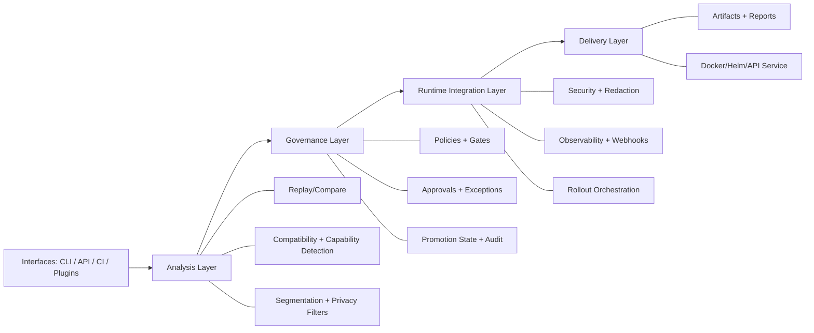
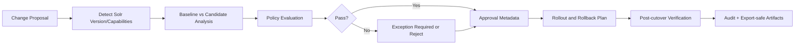
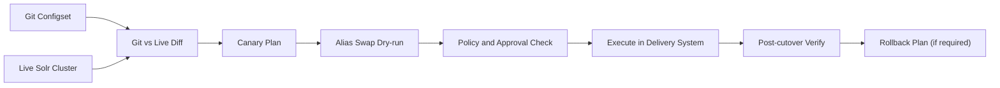

# SolrGuard Architecture

## Overview

`solrguard` is a local-first search change governance toolkit for Apache Solr. The CLI orchestrates a staged workflow that:

1. captures reproducible baseline metadata
2. provisions a shadow collection/configset
3. loads or samples documents
4. loads or extracts queries
5. replays baseline vs shadow
6. computes ranking and non-ranking diffs
7. emits machine-readable artifacts and a single-file HTML report

The design is additive. New feature tracks attach extra artifacts and report sections without
changing the base replay/compare contract.

## Core Pipeline

```text
changeset + docs + queries
        |
        v
validate -> snapshot -> inspect -> preflight
        |
        v
shadow create -> docs sample/load -> index
        |
        v
queries extract/load -> replay -> compare
        |
        +--> rewrite diff
        +--> explain capture
        +--> vector/hybrid scenario replay
        +--> performance capture
        +--> root-cause analysis
        +--> recommendations
        +--> LTR impact
        +--> optional plugin execution
        |
        v
report.json + report.html + run_manifest.json + plugins.json
```

## Layered Architecture Diagram



## Governance Workflow Diagram



## GitOps Rollout Flow



## Main Packages

### CLI and orchestration

- `schema_lens/cli.py`
- `schema_lens/config.py`
- `schema_lens/errors.py`
- `schema_lens/api/`

`cli.py` owns stage ordering, artifact paths, and run manifest updates. Feature packages expose
small assembler functions so orchestration stays thin. `api/` exposes service-mode wrappers over
the same core workflow with queued run execution and artifact serving.

### Solr transport and APIs

- `schema_lens/http/`
- `schema_lens/solr/`
- `schema_lens/shadow/`

These modules isolate Solr HTTP concerns, retries, admin endpoints, schema APIs, configset
handling, and collection lifecycle management.

### Inputs

- `schema_lens/changesets/`
- `schema_lens/data/`
- `schema_lens/queries/`
- `schema_lens/schema/`
- `schema_lens/snapshot/`

These packages parse/validate changesets, sample documents, extract queries from files/logs,
build schema dependency graphs, and capture deterministic baseline snapshots.

### Replay and compare

- `schema_lens/replay/`
- `schema_lens/compare/`
- `schema_lens/vector/`
- `schema_lens/compat/`

`replay` executes lexical baseline/shadow requests. `vector` adds scenario-based replay and
client-side hybrid simulation. `compare` computes ranking, facet, filter, sort, rewrite, explain,
gate, and report-ready summaries. `compat` detects Solr version and exposes capability adapters so
optional features degrade cleanly across Solr 8/9/10.

### Analysis tracks

- `schema_lens/perf/`
- `schema_lens/rootcause/`
- `schema_lens/recommend/`
- `schema_lens/ltr/`
- `schema_lens/env_compare/`
- `schema_lens/monitor/`
- `schema_lens/plugins/`
- `schema_lens/security/`
- `schema_lens/observability/`
- `schema_lens/governance/`
- `schema_lens/rollout/`
- `schema_lens/segments/`
- `schema_lens/privacy/`

These packages are optional, additive tracks:

- `perf`: latency, cache, and index-footprint estimation
- `rootcause`: deterministic diagnosis rules
- `recommend`: action-oriented follow-ups from root causes
- `ltr`: feature-log aware rerank drift
- `env_compare`: cross-cluster drift
- `monitor`: snapshot-vs-current drift history
- `plugins`: optional extension SDK (contracts, registry, loader, compatibility checks)
- `security`: auth resolution, secret loading, redaction, audit trail, execution profiles
- `observability`: run events, webhook sinks, Prometheus text export, OTel-style stage spans
- `governance`: approvals, policy bundles, exceptions, promotion state, optional manifest signing
- `rollout`: GitOps drift checks, canary plan generation, alias swap/rollback plans, post-cutover verification
- `segments`: multi-tenant/segment aggregation and segment-level policy checks
- `privacy`: PII masking, export-safe transformations, retention pruning

### Presentation

- `schema_lens/report/`
- `schema_lens/dashboard/`
- `schema_lens/ci/`

`report` builds JSON and HTML bundles. `dashboard` serves a read-only local UI over artifacts on
disk. `ci` formats PR-friendly markdown summaries.

### Packaging and deployment

- `docker/`
- `helm/solrguard/`
- `scripts/release/`
- `.github/workflows/release.yml`

These assets support enterprise deployment paths (containerized CLI/API mode, Helm-managed service
deployment, and release artifact generation).

## Artifact Model

Core run artifacts:

- `run_manifest.json`
- `snapshot*.json`
- `compat.json`
- `schema_risk.json`
- `shadow.json`
- `replay.json`
- `compare.json`
- `report.json`
- `report.html`

Optional additive artifacts:

- `docs_sample.jsonl`
- `queries_extracted.jsonl`
- `vector_validation.json`
- `hybrid_sensitivity.json`
- `perf_metrics.json`
- `rootcauses.json`
- `recommendations.json`
- `env_compare.json`
- `ltr_impact.json`
- `plugins.json`
- `audit.json`
- `governance.json`
- `observability_events.jsonl`
- `otel_spans.json`
- `webhook_deliveries.json`
- `prometheus_metrics.prom`
- `segments.json`
- `privacy.json`
- `latest_monitor.json`
- `monitor_history.jsonl`

Missing optional capabilities must serialize as:

```json
{"enabled": false, "reason": "..."}
```

This keeps downstream report/dashboard code stable.

## Plugin Boundaries

Plugin runtime is intentionally narrow:

1. Discovery: built-in + local directories + Python entry points
2. Contract check: metadata and version compatibility
3. Lifecycle: `validate -> initialize -> (phase hooks) -> execute -> cleanup`
4. Isolation: plugin failures are recorded in artifacts and only block runs in strict mode

Plugin boundary diagram:

```text
changeset/plugins config
        |
        v
  PluginLoader ----> PluginRegistry
        |                 |
        v                 v
  PluginRuntime ----> phase hooks
  (plugin_service)       - query/doc source
        |                - auth/replay/analyze
        v                - gate/report/rollout
 out/<run>/plugins/*     - observability events
        |
        v
plugins.json + compare.json.plugins + report.json.plugin_report_sections
```

Core replay/compare logic stays in first-party packages; plugins are additive and optional.

## Backward-Compatibility Rules

1. Existing commands stay valid.
2. Existing artifact keys are never removed in-place.
3. New sections are additive only.
4. Feature packages must tolerate partial artifacts and missing Solr capabilities.
5. Deterministic logic is preferred over opaque inference.

## Testing Strategy

1. Fast unit tests cover:
   - parser/validator logic
   - diff metrics
   - root-cause and recommendation rules
   - performance summarization
   - env compare/auth helpers
   - monitor history and drift math
   - LTR feature parsing
2. Docker integration tests cover Solr-dependent behavior.
3. Smoke targets (`make smoke`, `make smoke-vector`, `make smoke-matrix`) validate end-to-end
   slices against the bundled SolrCloud example.
