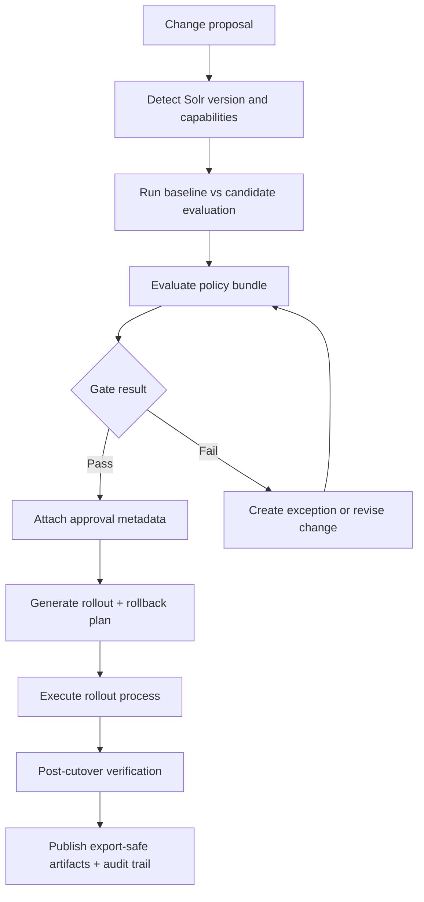

# Enterprise Evaluation Workflow

This page describes the recommended SolrGuard governance flow for production-bound Solr changes.

## Workflow

## Stage outputs

1. Capability stage: `compat.json`, missing capability notes, fallback path summary.
2. Analysis stage: `compare.json`, `report.json`, `report.html`.
3. Governance stage: `governance.json`, policy verdicts, approvals/exceptions metadata.
4. Rollout stage: alias/canary/rollback plan artifacts under `out/<run>/`.
5. Verification stage: post-cutover check output and run status summary.

## Suggested runbook

1. Start with compatibility detection against target environment.
2. Run full comparison with representative query and document inputs.
3. Evaluate policy bundle and segment-aware thresholds.
4. Attach approval details and any expiring exceptions.
5. Generate privacy-safe summary for change advisory or release notes.
6. Execute canary/alias workflow outside SolrGuard using generated plan steps.
7. Verify post-cutover and archive audit trail artifacts.
