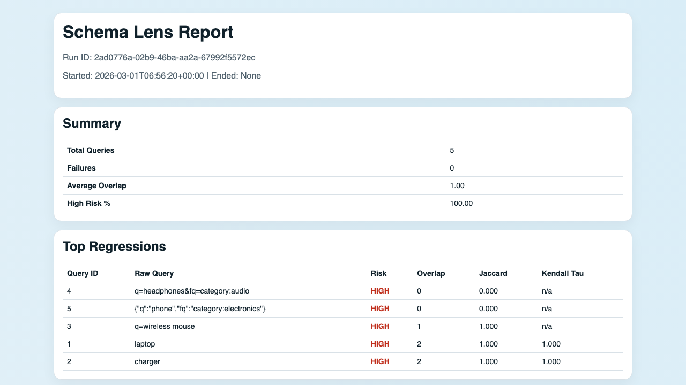
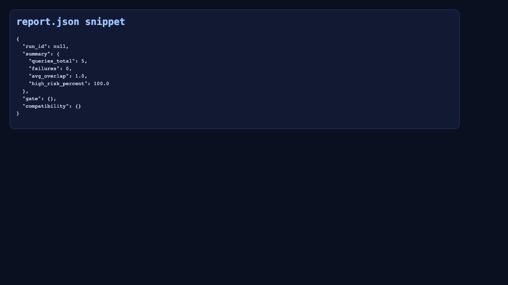

# Example Outputs

This page shows real artifacts generated from a local demo run (`out/demo`).

## report.html preview

[](../out/demo/report.html)

## report.json snippet preview

[](assets/report_json_snippet.html)

## Where these come from

- HTML report: `out/demo/report.html`
- JSON report: `out/demo/report.json`

You can regenerate these by running the first-time evaluator script:

```bash
./scripts/first_time_evaluator.sh
```
